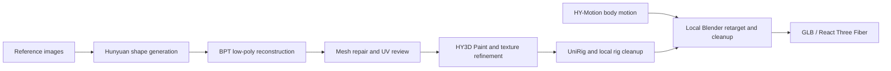

# Shape-gen

Shape-gen runs local AI models to turn reference images into 3D meshes, reconstruct
low-poly geometry, paint textures, predict rigs and generate body motion. It
provides command-line runners and an authenticated HTTP API, so another machine
can orchestrate GPU work while keeping Blender and the game project local.

The main workflow targets stylized, low-poly game assets. Outputs are drafts:
geometry, UVs, skinning and animation still need visual review and often cleanup.



## What it provides

| Capability | Models / tools | Status |
|---|---|---|
| Image → dense mesh | Hunyuan3D-2 full, mini and multiview | Main workflow |
| Mesh → low-poly mesh | BPT | Main workflow; no exact triangle-count guarantee |
| Mesh + image → texture | Hunyuan3D Paint + Delight | Base-color painting; UV/material review needed |
| Mesh → skeleton and skin weights | UniRig | Draft rig; semantic mapping and deformation review needed |
| Text → body motion | HY-Motion Lite | Raw motion; retargeting and loop/contact cleanup local |
| Alternative shape generation | TRELLIS, TRELLIS.2 | Experimental |
| Alternative mesh reconstruction | DeepMesh, LATO.2 | Experimental |
| Remote orchestration | FastAPI, durable job queue, SSE progress, hashed artifacts | Single GPU worker |
| Asset review | Browser GLB/animation preview, Blender reference helpers | Consumer tools |

The nine model API operations run without launching Blender. A separate, optional
legacy operation retargets onto the original character on the server; new installs
should disable it. Image-generation services are not included or exposed by this API.

## Requirements

- **GPU host:** Linux x86-64 with an NVIDIA GPU and a working driver. This setup was
  exercised on an RTX 3050 with 8 GB VRAM and 64 GB system RAM. That is a tested
  configuration, not a guarantee that every model/input fits in 8 GB.
- Git, [uv](https://docs.astral.sh/uv/getting-started/installation/), and Python 3.11
  (uv can install it). Experimental environments use Python 3.10 separately.
- Disk space for weights, Python environments and build caches. Mini alone is
  3.82 GB of model files; the complete installation occupies over 100 GB. Install
  only the stages you need. HY-Motion also downloads a large CPU text encoder.
- Paint and some experimental models compile native extensions. Their guides
  cover the private CUDA/compiler setup. A working driver is still required.
- **Consumer:** Python 3 for the supplied HTTP client; Blender for mesh/rig editing
  and retargeting. The consumer can be a Mac and does not need an NVIDIA GPU.

Model and upstream-code licenses apply independently. Download access does not
replace reviewing their terms. TRELLIS.2's DINOv3 dependency requires Hugging Face
access approval; the basic Hunyuan/BPT path does not depend on DINOv3.

## Start here: generate a mesh

Get this repository, enter its root, then follow the commands below. All commands
in these guides assume that working directory. See [core setup](docs/setup.md)
for OS dependencies, troubleshooting and optional Paint/BPT installation.

```sh
uv python install 3.11
uv run --no-project --python 3.11 python scripts/setup_sources.py Hunyuan3D-2
uv sync --locked --no-install-package custom-rasterizer --no-install-package mesh-processor
.venv/bin/python scripts/setup_models.py mini

mkdir -p ~/.cache/shape-gen
flock ~/.cache/shape-gen/gpu.lock .venv/bin/python scripts/check_environment.py
flock ~/.cache/shape-gen/gpu.lock .venv/bin/python scripts/generate.py /path/to/reference.png \
  --model mini --output-dir assets/my-first-model
```

Use a new output directory for each run. The dense mesh is
`assets/my-first-model/01-dense.glb`. For this partial installation, call
`.venv/bin/python` directly: an ordinary `uv run` can try to install the optional
Paint extensions. Full and multiview weights are optional downloads, described in
the setup guide.

## Start the API

[API setup](docs/setup.md#start-the-api) covers token creation, startup and a
persistent user service. After installing `.venv-api` and provisioning the token:

```sh
SHAPE_API_LEGACY_PROFILE=0 .venv-api/bin/python -m uvicorn shape_api.server:app \
  --host 127.0.0.1 --port 8765 --workers 1 --no-access-log
```

In another terminal:

```sh
python3 scripts/shape_api_client.py --base-url http://127.0.0.1:8765 health
python3 scripts/shape_api_client.py --base-url http://127.0.0.1:8765 operations
python3 scripts/shape_api_client.py --base-url http://127.0.0.1:8765 docs
```

For a remote consumer, bind to your private network address and give them that
base URL, the token through a private channel, and the
[agent API guide](docs/api-agent.md) (also served at `/docs/agent.md`). The client
requires no third-party Python packages. Use `upload`, `submit-json`, `watch` and
`download` to run and retrieve work. Each operation needs its own installed model
and environment; a healthy HTTP server alone does not establish model readiness.

The API **does not automatically reload code**. Wait for the queue to be idle,
stop the service, update and test, then restart it. See
[operations](docs/api-operations.md#applying-code-changes).

## Documentation

[Browse the documentation index](docs/INDEX.md) for summaries, topic tags and
when to read each file. Rebuild it with `python3 scripts/build_docs_index.py`.

| Read this | For |
|---|---|
| [Core setup](docs/setup.md) | Hunyuan, BPT, Paint, tokens, API startup and systemd |
| [Rigging and motion setup](docs/setup-animation.md) | UniRig/HY-Motion environments, checkpoints and handoffs |
| [Experimental model setup](docs/setup-experimental.md) | DeepMesh, LATO.2 and both TRELLIS versions |
| [API agent guide](docs/api-agent.md) | Uploads, job parameters, live progress and downloads |
| [API operations](docs/api-operations.md) | Deployment, restarts, recovery and validation |
| [Blender handoff](docs/blender-handoff.md) | Data contracts, local rigging and retargeting |
| [Geometry alternatives](docs/api-geometry-experiments.md) | Choosing and comparing experimental API stages |
| [Repository storage](docs/repository-storage.md) | What belongs in Git and what to back up separately |
| [Project history](docs/project-history.md) | Previous runs, measurements and research context |

## Layout and reproducibility

- `scripts/`: setup, model runners, review helpers and standard-library API client.
- `shape_api/`, `tests/`: service implementation and contract tests.
- `config/`: pinned environments, upstream source revisions and model download catalog.
- `docs/`: maintained setup/reference guides and dated research.
- `assets/`: preview and experiment source; generated binaries are ignored.
- `models/`, `third_party/`, `.venv*/`, `.toolchain/`: downloaded dependencies,
  ignored by Git. Setup helpers recreate these; they are not part of a clone.
- `var/api/`: private queue, uploads and results, also ignored.

`scripts/setup_sources.py --list` lists pinned upstream code. From the core
environment, `scripts/setup_models.py --list` lists model groups and download sizes;
`--verify-only mini` checks existing weights without downloading. Model setup also
creates the metadata sidecars required by the runners. Separate downloaders cover
BPT and animation. See the setup guides for all commands.

The browser preview accepts your own GLB, including textures and animation clips;
see [preview setup](docs/setup.md#browser-preview). Historic examples, accepted
character bundles and model weights are not distributed in Git. Generated outputs
and any irreplaceable references need separate backups.
