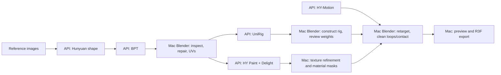

# Shape-gen API: agent guide

Version: 0.4.2. Start here when driving the GPU machine from another agent.
This same document is served at **`GET /docs/agent.md`**.

## Connect and discover

- Base URL: supplied by the operator. The server setup example binds to
  `http://127.0.0.1:8765`; the Python client still defaults to the original
  `http://100.66.127.115:8765` Tailscale deployment. Set `--base-url` explicitly
  when connecting to a different installation.
- Every endpoint requires `Authorization: Bearer <token>`, including this guide,
  health and `GET /openapi.json`. Credentials are supplied separately as a file;
  never put them into prompts, query strings, source files or logs.
- Use `GET /health`, then **`GET /operations`** for model operations, input roles
  and parameter schemas. `GET /profiles` describes the legacy teal retarget job.
  `GET /openapi.json` gives the HTTP schema; `/operations` supplies the specific
  parameter schemas used inside each job's `parameters` object.
  No WebSocket is needed: SSE carries one-way live events; ordinary HTTP
  handles submit/cancel/download.
- Prefer calling this service from the main-machine agent or app backend. The
  service does not enable cross-origin browser access or expose a token to the
  public app. A browser frontend can use its own authenticated backend proxy.

## Current capability and limits

The Mac owns orchestration, Blender and visual review. This server owns the
installed GPU model stages. Each stage is submitted to the same `POST /jobs`
route, distinguished by `operation`; it uses the same queue, SSE and artifact API.

| Operation | Required `inputs` (asset IDs) | Primary output |
|---|---|---|
| `hunyuan-shape` | `front`: PNG/JPEG; optionally `left`, `back`, `right` for mv | `result/01-dense.glb` |
| `trellis-shape` | `front`: RGBA cutout; optional left/back/right | `result/01-dense-raw.glb` (experimental) |
| `trellis2-shape` | `front`: RGBA cutout | `result/01-dense-remesh.glb` by default (experimental) |
| `deepmesh-retopology` | `mesh`: static GLB | `result/02-deepmesh.glb` and OBJ (experimental) |
| `lato2-retopology` | `mesh`: static GLB | `result/02-lato2.glb` and OBJ (experimental) |
| `bpt-retopology` | `mesh`: static GLB | `result/02-bpt.glb` and OBJ |
| `hy3d-paint` | `mesh`: static GLB, `reference`: PNG/JPEG | `result/03-textured.glb`, basecolor atlas and projected views |
| `unirig` | `mesh`: numeric NPZ with exactly `vertices`, `faces` | `result/rig-data.npz`, joints/parents/tails/weights |
| `hymotion` | none (`inputs: {}`) | `result/motion.npz`, raw body motion |

**None of these nine operations invokes Blender.** Mesh repair, seam/UV work,
texture refinements and clothing masks, rig construction, semantic bone mapping,
retargeting, loop/contact cleanup, render/export and R3F integration run on the Mac.
Image generation remains a consumer-side capability; no imagegen endpoint exists.
See **`GET /docs/blender-handoff.md`** for array/axis contracts and local recipes.

### New in 0.4.2: independent model-only installation

Operators can set `SHAPE_API_LEGACY_PROFILE=0` to start without the old character
assets or Blender. `/profiles` then returns an empty list and the legacy operation
is disabled; the nine model operations keep their contracts. `/health` reports
runner-interpreter presence, not complete model or GPU readiness. Use `submit-json`
for generic operations; the client's `submit` shortcut requires the legacy profile.
Operator installation instructions are in `docs/setup.md` in the repository.
That guide is not served by this API or included in the consumer handoff export.

### New in 0.4.1: automatic LATO.2 normal recalculation

New `lato2-retopology` requests default to `recalculate_normals:true`. A CPU-only
Trimesh stage corrects winding before export validation, preserves raw GLB/OBJ
artifacts, and publishes `normal-recalculation.json`. No Blender is launched.
Set the flag to false to compare raw generation. Holes, overlaps and nonmanifold
edges are not repaired by this stage. See `/docs/geometry-experiments.md`.

### New in 0.4: geometry alternatives

TRELLIS, TRELLIS.2, DeepMesh and LATO.2 are now available as independent model
operations through the existing queue. See **`GET /docs/geometry-experiments.md`**
for book/prop comparison recipes, parameter bounds, transparency requirements,
output names and limits. Consumers can compare every reconstruction model on the
same uploaded/generated dense GLB. Existing Hunyuan/BPT defaults are unchanged.

### New in 0.3: helper downloads and motion diagnostics

- **`GET /helpers`** discovers versioned Blender reference bundles with hashes.
  Each `blender-helpers` bundle includes the retargeter, preservation review, rig-contract
  checker, local motion analyzer and supporting docs/contract JSON. Download URLs
  and per-file hashes are in its catalog/manifest. Run Blender locally; no SSH
  fetch or server-side Blender execution is needed for these helpers.
- **`GET /clients/shape_api_client.py`** downloads the updated standard-library
  client over authenticated HTTP; use `helper-download --version 1.0.3 --output NEW_DIR`.
- New motion jobs publish **`motion-diagnostics.json`**: root travel, speed over
  time, root-stationary tail, candidate repeating segments and estimated contacts.
  **`GET /jobs/{id}/motion-diagnostics`** also analyzes completed older motion jobs
  without changing their original artifacts. Read **`GET /docs/motion-diagnostics.md`**.
- Numerical validation, diagnostics and visual acceptance remain distinct.
  **A numerical speed in a text prompt is not an endpoint speed constraint.**
  Local retargeting, stride/contact cleanup and runtime checks establish exact speed
  and a usable loop. Diagnostic units refer to the source model, before target scaling.



### Upload and chain inputs

`POST /assets` accepts a **raw binary body**, `Content-Type: application/octet-stream`;
not multipart and not a server path. Maximum 64 MiB. Supported inputs:

- PNG/JPEG, 16–4096 pixels per side.
- Static, self-contained GLB 2.0. Export without skins, animations, external/data
  URIs or required compression extensions. UVs are required for preserved-UV paint.
- NPZ containing exactly finite `vertices` (N×3, up to 200,000) and integer triangle
  `faces` (M×3, up to 400,000). No pickle or object arrays. Coordinates must already
  be Blender world Z-up, character forward -Y; vertex order must match the mesh
  that will receive weights. Separate rigid accessories before submitting.

Model-input uploads return `id` (= SHA-256), `kind`, size and format metadata.
Identical bytes deduplicate.
`GET /assets/{id}` returns metadata; `/assets/{id}/content` downloads the original.
Model outputs have an **`asset_id` on their primary artifact** and can become
the next job's input without downloading/re-uploading. For example, use the dense
GLB's asset ID directly as BPT's `inputs.mesh`. Local Blender edits create a new
upload/asset ID. The legacy registered `.blend` upload remains supported only for
its exact profile hash; arbitrary Blender files are not accepted. That legacy
case instead returns `{id, bytes, profile: "teal-v1", deduplicated: true}` with no
`kind`. It is a profile registration response, not an ordinary model-input asset
record; use `/profiles` for its contract rather than the generic asset lookup.

```json
{
  "request_id": "character-shape-01",
  "operation": "hunyuan-shape",
  "inputs": {"front": "SHA256_FROM_UPLOAD"},
  "parameters": {"model": "mini", "seed": 12345, "steps": 50, "resolution": 128}
}
```

```json
{
  "request_id": "character-bpt-01",
  "operation": "bpt-retopology",
  "inputs": {"mesh": "DENSE_GLB_ARTIFACT_ASSET_ID"},
  "parameters": {"seed": 12345, "temperature": 0.5, "max_tokens": 10000}
}
```

```json
{
  "request_id": "character-paint-01",
  "operation": "hy3d-paint",
  "inputs": {"mesh": "UPLOADED_UV_GLB_ID", "reference": "REFERENCE_IMAGE_ID"},
  "parameters": {"preserve_uvs": true, "steps": 30, "texture_size": 1024, "render_size": 1024}
}
```

```json
{
  "request_id": "character-rig-01",
  "operation": "unirig",
  "inputs": {"mesh": "UPLOADED_NUMERIC_MESH_ID"},
  "parameters": {"seed": 12345}
}
```

```json
{
  "request_id": "character-motion-01",
  "operation": "hymotion",
  "inputs": {},
  "parameters": {"prompt": "A person stands still and slowly looks around.", "seed": 12345, "duration": 4}
}
```

### Model parameters and limits

`seed` is an integer 0–4294967295, default 12345, for all model operations.
Unknown parameters/roles are rejected. Bounds restrict requests; they do not
guarantee every input/settings combination will fit 8 GB VRAM.

| Operation | Other parameters (defaults in parentheses) |
|---|---|
| Shape | `model`: full/mini/mv (mini); `steps`: 1–100 (50); `resolution`: 64/128/192/256 (128); `chunks`: 256–8192 (1024); `guidance`: 0–20 (5); `keep_background`: false |
| BPT | `temperature`: >0–2 (0.5); `max_tokens`: 250–10000 (10000); `encoder_device`: cuda/cpu (cuda) |
| Paint | `steps`: 1–50 (30); `texture_size`: 512/1024/2048 (1024); `render_size`: 512/1024 (1024); `preserve_uvs`: true |
| UniRig | Seed only; staged skeleton/skin prediction and transfer to exact original vertices, up to four influences |
| Motion | `prompt`: 3–500 nonblank characters; `duration`: exactly 4 seconds |

Shape `mv` requires `front` plus at least one other view. Full/mini accept only
`front`. Paint includes the installed Delight pass; it validates UV/geometry
preservation when requested. With `preserve_uvs: false`, the paint runner unwraps
using its built-in xatlas stage; preferred reviewed UVs can be supplied from Blender.
BPT's token cap is **not a triangle target**: reaching it before an end token
fails the job instead of publishing a truncated mesh. BPT may still need repair.
UniRig names are generic `bone_0`, `bone_1`, …; they are not a ready-made semantic
humanoid mapping. Motion has 120 samples at 30 fps, 22 body rotation joints,
root translation and rest-skeleton metadata; no fingers, retargeting or loop cleanup.

All model results include `validation.json`, `provenance.json` and runner reports.
Mesh validation checks finite geometry and reports topology; **watertightness is
reported, not required for success**. Rig validation checks parents, finite arrays,
normalized weights and influence count. Motion validation checks rotation matrices.
These checks do not establish visual quality or fitness for deformation.

## Legacy combined motion operation

For compatibility, **`hymotion-retarget`**, profile **`teal-v1`**, still runs
text encoding → HY-Motion Lite → retarget onto the registered teal character →
Blender/GLB validation and four fixed-camera review renders. One GPU job runs
at a time; CPU render stages remain within that job's serial execution.

Its rig input must be the exact accepted teal revision returned by `/profiles`.
It is already registered, so upload is optional. Other `.blend` revisions return
422. No server path, shell command or arbitrary Python operation is accepted.

Supported parameters:

| Name | Rule |
|---|---|
| `prompt` | 3–500 characters, nonblank human-motion description |
| `seed` | Integer 0–4294967295; default 12345 |
| `duration` | Currently exactly 4 seconds; default 4 |
| `clip_name` | Starts with a letter; letters/digits/underscore/hyphen, at most 64 characters; default `Candidate_Motion` |

The output contains **one raw candidate action**, not the existing five-clip
runtime set. Its GLB is suitable for generic animation inspection. The provided
five-clip `TealPeasant.jsx` controller expects its named idle/walk set and must
not be pointed at this one-clip candidate without adaptation.

Raw motion is not promised to loop, stay in place or have locked foot contact.
Clip duration is 119 intervals at 30 fps (3.9667 seconds) for 120 generated
samples. Per-character loop/stance cleanup is not exposed yet. Never replace
the accepted character automatically just because a job succeeds.

## Submit/retry any job

Generate a unique `request_id` for each intended execution. Reuse that ID with
identical parameters after a network failure: the API returns the existing job
instead of launching another. Reusing it with different parameters returns 409.
To retry a failed/canceled/interrupted job, explicitly use a new request ID.

```json
{
  "request_id": "teal-look-20260918-01",
  "operation": "hymotion-retarget",
  "profile": "teal-v1",
  "rig_asset_id": "COPY_THE_SHA256_ID_FROM_GET_PROFILES",
  "parameters": {
    "prompt": "A person stands still and slowly looks to the left and right.",
    "seed": 24110,
    "duration": 4,
    "clip_name": "Candidate_LookAround"
  }
}
```

`POST /jobs` returns 202 with the job record and `Location: /jobs/{id}`. An
idempotent replay returns 200. The queue allows up to 16 waiting jobs; 429 means
retry later. A stage times out after 20 minutes. Submit only small reviewed
batches: queued work consumes real GPU time.

## Watch live updates

Open **`GET /jobs/{id}/events`** with the bearer header. The response is
`text/event-stream`; delivery starts with saved events and then follows live work.

```text
id: 42
event: stage
data: {"id":42,"event":"stage","data":{"name":"motion","state":"started"},"created_at":"..."}

```

Event types are `status`, `stage`, `log`, and a final unnumbered `end`. `log`
events carry `data.stage` and `data.text`; text is UTF-8 chunks and can contain
carriage-return progress updates or multiple lines. There are no invented
percentage estimates. Status includes job state, stage, cancellation and errors.

Save the last processed numbered event ID. On reconnect send
`Last-Event-ID: <id>` (or `?after=<id>`); only later events are returned. Deduplicate
by ID. Heartbeat comments arrive approximately every 10 idle seconds. A terminal
job drains its stored events, sends `end`, then closes the stream. If using an
auto-reconnecting client, stop reconnecting on `end` and fetch the final job.
Service restart preserves event IDs and history. Event retention is currently
indefinite; no pruning or replay-gap policy has been introduced.

Native browser `EventSource` does not provide a custom Authorization-header
option. Use an authenticated fetch stream or your app's backend proxy. Do not
put the API token in the SSE URL. The supplied Python client uses authenticated
HTTP streaming and reconnects with its last processed event ID.

Polling fallback: `GET /jobs/{id}` for state, and
`GET /jobs/{id}/logs?after=<cursor>&limit=200` for persisted events. The response
includes `events` and `next_cursor`; this cursor covers all event types, not
only log entries. `GET /jobs?limit=50` lists recent jobs.

## Cancel, recover and distinguish outcomes

`POST /jobs/{id}/cancel` is idempotent. Queued jobs cancel immediately; running
jobs set `cancel_requested` and terminate their process group. Wait for a
terminal state before assuming GPU memory has been released.

| State | Meaning / next action |
|---|---|
| `queued` | Waiting for worker/GPU lock |
| `running` | Read stage/log events; disconnecting does not cancel execution |
| `succeeded` | Export checks passed and candidate artifacts are published; visual review remains pending |
| `failed` | Inspect `error` and logs; partial files are retained server-side but not published as completed outputs |
| `canceled` | Requested stop completed; retry requires a new request ID |
| `interrupted` | Service stopped during execution; do not assume completion; retry with a new request ID |

Service restart retains queued jobs; interrupted active jobs do not automatically
resume inference. Shutdown terminates subprocess groups; systemd additionally
owns the process cgroup. Ordinary accepted asset files are never modified.

HTTP failures:

| Status | Meaning |
|---|---|
| 400 | Malformed or out-of-range SSE `Last-Event-ID` cursor |
| 401 | Missing or invalid bearer token |
| 404 | Unknown job, asset, helper version, unpublished/unavailable artifact, or missing raw motion for diagnostics |
| 409 | Conflicting request ID, diagnostics requested before success, or a helper/motion integrity check failure |
| 413 | Upload exceeds 64 MiB |
| 415 | Upload content type is not `application/octet-stream` |
| 422 | Invalid request schema, unsupported/invalid inputs or parameters, or diagnostics requested for a non-motion operation |
| 429 | Queue is full |
| 503 | `/health`: worker task has ended, or enabled legacy-profile prerequisites are missing |

Missing optional runner interpreters are reported in `runner_environments_present`;
they do not by themselves cause a 503. With the legacy profile enabled, health also
requires its Blender executable, HY-Motion interpreter and Lite checkpoint. Health
does not import every runner, verify every weight or attempt GPU inference.

## Download and review

`GET /jobs/{id}/artifacts` returns published files with IDs, names, sizes,
SHA-256 hashes and relative download URLs. Download via `GET /artifacts/{id}`,
verify the hash against the manifest and save into a **new candidate directory**.
Use only safe relative artifact names under that directory.

Legacy combined-motion outputs include candidate Blender/GLB, renders, retarget/export validation,
inference measurements, script/profile/model provenance and the matching clothing
mask/palette. Large intermediate encoder tensors are not published.

For the legacy combined operation:

1. Check job success and `validation.status == "passed"`.
2. Verify downloaded hashes and inspect the four review renders.
3. Open `candidate/peasant-walk.glb` in a generic GLB animation viewer; the legacy
   filename is retained, but the action uses the requested `clip_name`.
4. Review the whole motion, including hands, clothes, floor interaction and root
   travel. Numeric export validation is not visual acceptance.
5. Record acceptance or requested changes in the consuming project's workflow.
   Loop cleanup and merging into the accepted clip library are separate work.

The service records the previously verified model-download manifest and script
hashes. It does not rehash all multi-gigabyte model weights on every job. Seeds
and provenance aid reproduction; hardware/library changes may alter exact output.

## Supplied client

`scripts/shape_api_client.py` needs Python 3.9+ and only the standard library.
The token file is read locally; it is not printed. Set the operator-provided URL
explicitly. Example on the Mac using the original deployment:

```sh
SHAPE_API_URL='http://100.66.127.115:8765' # Replace with your operator-provided URL.
python3 shape_api_client.py --base-url "$SHAPE_API_URL" --token-file ~/.config/shape-gen/api-token health
python3 shape_api_client.py --base-url "$SHAPE_API_URL" --token-file ~/.config/shape-gen/api-token profiles
python3 shape_api_client.py --base-url "$SHAPE_API_URL" operations
python3 shape_api_client.py --base-url "$SHAPE_API_URL" helpers
python3 shape_api_client.py --base-url "$SHAPE_API_URL" helper-download --version 1.0.3 --output ./blender-helpers-1.0.3
python3 shape_api_client.py --base-url "$SHAPE_API_URL" diagnostics JOB_ID
python3 shape_api_client.py --base-url "$SHAPE_API_URL" upload front.png
python3 shape_api_client.py --base-url "$SHAPE_API_URL" submit-json shape-request.json
python3 shape_api_client.py --base-url "$SHAPE_API_URL" --token-file ~/.config/shape-gen/api-token submit --request-id my-look-01 --prompt 'A person stands still and slowly looks around.' --clip-name Candidate_Look
python3 shape_api_client.py --base-url "$SHAPE_API_URL" --token-file ~/.config/shape-gen/api-token watch JOB_ID
python3 shape_api_client.py --base-url "$SHAPE_API_URL" --token-file ~/.config/shape-gen/api-token download JOB_ID --output ./incoming/my-look-01
python3 shape_api_client.py --base-url "$SHAPE_API_URL" --token-file ~/.config/shape-gen/api-token cancel JOB_ID
```

`watch --after EVENT_ID` resumes from a saved cursor. `upload FILE` registers
supported input bytes. `submit-json FILE.json` submits any named model operation;
`submit --prompt ...` remains the legacy teal combined operation. `get JOB_ID` retrieves final status. `docs`
downloads this guide. All commands accept `--base-url` before the subcommand.

## Protocol references

- [SSE format and replay IDs](https://html.spec.whatwg.org/dev/server-sent-events.html).
- [StreamingResponse](https://starlette.dev/responses/#streamingresponse).

Arbitrary Blender uploads, server-side Blender cleanup endpoints, automatic bone
semantic mapping, stage caching, retention pruning and OpenScape/R3F application
integration are outside the current API. The Mac agent orchestrates the stages and local work.
