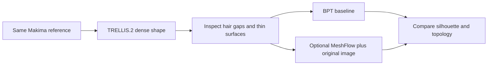

# Alternatives after the Makima LATO.2 experiment

Checked 2026-09-18. Research only; no additional model installed in this turn.

## Conclusion

I could not verify a released, ready-to-run replacement that provides Meshy T2's
direct image-conditioned artist-mesh workflow and comparable character quality
on this machine. This is a release/validation finding, not a claim that no such
research exists. The most relevant next experiment is replacing Hunyuan shape
with TRELLIS.2, inspecting the raw dense geometry before any retopology.

Our [Makima comparison](makima-geometry-review-2026-09-18.md) established two
separate issues: merged-looking hair joins already in the dense source, and new
connectivity defects in LATO.2's output. One character, one seed and a 1,200-vertex
target do not rule out LATO.2 generally.

## Verified candidates and boundaries

| Model | Released path / availability | Relevance |
|---|---|---|
| [Meshy T2](https://github.com/meshy-dev/meshy-t2) | Public repository still preparing code/weights | Desired direct image-to-artist-mesh path, unavailable locally today |
| [EdgeRunner](https://github.com/NVlabs/EdgeRunner) | Image-conditioned inference code exists; raw README has pretrained-checkpoint release unchecked | Conceptually direct image-to-mesh, but no verified official ready checkpoint download; documented inference ~16GB |
| [Nautilus](https://github.com/Yuxuan-W/Nautilus) | README says full model cannot be released under company policy; generation inference awaits checkpoints | Image-conditioned research is not a usable released replacement |
| [Meta MeshFlow](https://github.com/facebookresearch/meshflow) | Code/weights; mesh or surface point cloud required, reference image optional | Can test retopology with original-image evidence; still geometry-conditioned |
| [DeepMesh](https://github.com/zhaorw02/DeepMesh) | Released 0.5B weights and point-cloud-conditioned runner | Another BPT-stage candidate, not a way to bypass missing source geometry |
| [TRELLIS.2](https://github.com/microsoft/TRELLIS.2) | Code/4B weights; image-to-dense textured mesh | Most relevant upstream shape replacement; supports open surfaces/internal structures via O-Voxel |

MeshFlow's [project FAQ](https://mesh-flow.github.io/) explicitly says the released
model needs a surface point cloud and that single-image conditioning is ongoing
work. Its optional image encoder is DINOv3 and is not bundled with MeshFlow
weights; the repository documents requesting those backbone weights separately.
Do not confuse this Meta project with the separate `qiisun/MeshFlow` project.

Read raw GitHub Markdown when checking release boxes: the browsing renderer
prints both checked and unchecked items as `[Input]`. EdgeRunner's
[raw README](https://raw.githubusercontent.com/NVlabs/EdgeRunner/main/readme.md)
has `- [ ] Release pretrained checkpoints.`

## Why TRELLIS.2 is the next recommendation

Its representation explicitly handles open surfaces such as clothing and leaves,
and internal structures. That makes it a plausible candidate for improving thin
layers/gaps in the dense source. Whether it actually separates Makima's hair is
an untested inference, not established by representation capability alone.

It does not directly generate T2-style low-poly topology. Proposed workflow:

Official TRELLIS.2 lists 24GB VRAM. The
[StableProjectorz fork](https://github.com/IgorAherne/TRELLIS.2-stableprojectorz)
reports optimizations for 8GB even at 1024 cubed, but its packaged installer is
Windows-oriented. That establishes a source to investigate, not confirmed Linux
RTX 3050 compatibility or a promised runtime. Adapt and measure memory in an
isolated environment; start at 512 with batch one, geometry only, and offloading.
Do not assume FP8 execution is natively supported on the 3050 merely because FP8
checkpoint files are downloadable.

Preserve the raw generated mesh before optional watertight wrapping/remeshing;
those transformations can change the openings/layers this experiment is testing.
If the dense hair is still merged, stop before spending time on retopology.

## Further LATO.2 option

Our current LATO experiment uses the upstream mesh runner: a rendered view of
the Hunyuan mesh plus its voxel scaffold. It does not condition on the original
reference image. The [LATO.2 README](https://github.com/LoHhhha/LATO.2) suggests
TRELLIS sparse-structure generation for obtaining a scaffold directly from an
image. Connecting that scaffold and the original image to LATO is a possible
research integration, not an already tested turnkey direct-image endpoint.
It would address upstream conditioning, but not automatically fix the topology
defects seen in the existing LATO test.
