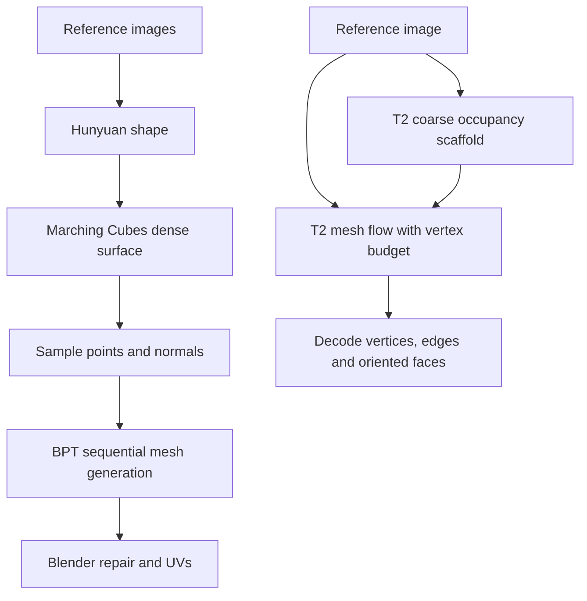

# Meshy T2 and the local shape-gen quality gap

Researched: 2026-09-18. Research only; no models installed or API behavior changed.

## Main finding

Meshy T2's paper describes both direct image-to-mesh generation and high-poly
retopology. Its direct path does not require a dense extracted surface first.
It predicts a coarse occupancy scaffold, then jointly generates a compact mesh's
continuous vertices, connectivity and face orientation. The scaffold is a spatial
condition, not the high-density output mesh used in our Hunyuan → BPT chain.

Primary source: the [Meshy T2 v3 paper](https://arxiv.org/abs/2607.28675v3), dated
12 August 2026, especially sections 2.1–2.3 and 3.2–3.3. The local downloaded
copy is `docs/research/2607.28675v3.pdf`, beside this note; PDFs are ignored by
Git and that optional local copy is absent from a fresh clone.

## Pipeline comparison

T2 uses a 64³ scaffold; a mesh VAE represents one continuous latent token per
vertex. The second flow model receives image tokens, scaffold tokens and a
requested vertex-slot budget. The VAE decoder reconstructs explicit vertices,
edges and oriented triangles. The 64³ scaffold is not the final coordinate grid:
vertices are predicted continuously, so it is incorrect to compare it directly
with our 128-resolution Marching Cubes setting as if they were equivalent output
resolutions. See paper sections 2 and 2.3.

The paper also evaluates a retopology mode taking both a reference image and a
100k-triangle dense mesh. In that mode, an overall dense → compact mesh workflow
is possible. The paper does not establish which exact internal branch, model
revision or additional postprocessing produced a particular Meshy webapp download.

## Why cleaner overhangs and layered details are plausible

These mechanisms are described in the paper; connecting them to Sean's specific
visual observations is an inference, since the Meshy output has not been inspected
side by side in this research turn.

1. **Explicit open boundaries.** The face representation includes a boundary
   sentinel rather than requiring every vertex neighborhood to form a closed fan.
   Open surfaces can be represented deliberately. A valid open cuff/hem/underside
   should not automatically be treated as an accidental hole to fill.
2. **Separate touching parts.** Distinct vertices can occupy the same location
   without being welded. Connectivity, rather than position equality, defines
   whether parts join. Disconnected components emerge from the generated graph;
   they are not necessarily semantically labeled equipment/clothing objects.
3. **Connectivity and winding are learned explicitly.** The model predicts edges
   and local neighbor ordering, with assembly rules for face orientation. This
   directly addresses problems related to the cracks and winding defects we saw
   in BPT. It does not guarantee every generated mesh is flawless.
4. **The final mesh model still sees the image.** It has evidence of visible
   structure in addition to the coarse 3D scaffold. Our BPT runner receives sampled
   geometry/normals, with no reference-image conditioning.
5. **Artist mesh connectivity survives the representation.** The autoencoder is
   trained to preserve original artist-authored mesh structure. Its nearly lossless
   reconstruction claim concerns encoding/decoding known meshes; it is not a claim
   that a generated image-conditioned mesh is always correct.

Overhangs are not mathematically forbidden in Hunyuan or an implicit surface.
Thin layers, narrow gaps and separate nearby surfaces are practical resolution,
representation and inference challenges. Good direct topology modeling is a
plausible advantage; an architectural explanation is not proof of the cause of
any particular missing feature.

## What the local implementation actually does

Inspected local evidence:

- `assets/teal-peasant/dense/generation.json`: the accepted teal source used
  Hunyuan3D-2mv, front/left/back views, 50 steps, resolution 128, Marching Cubes,
  and produced 29,822 triangles. This is the original character's dense mesh,
  not the later API mini smoke-test output.
- `scripts/retopo_bpt.py`: samples 50,000 points, selects 4,096 point/normal samples,
  then conditions BPT on that cloud. It generates discrete tokens sequentially,
  reconstructs faces, merges coincident vertices, removes duplicate/degenerate
  faces and fixes normals. Those cleanup steps do not infer clothing semantics.

There are therefore two separate opportunities to lose detail: dense shape
reconstruction/extraction, then point-conditioned compact-mesh generation.
A small feature already absent or fused in the dense mesh gives BPT little
geometric evidence to recover it. A feature that survives the dense mesh but
vanishes in BPT points toward the second stage. Raising extraction resolution can
help only when the learned field contains the feature; it cannot guarantee it.

Do not remove all merging as a quick fix: BPT initially emits per-face vertices,
so some reconciliation is needed to construct shared topology. T2's explicit
connectivity representation is not reproduced by toggling our merge call.

## Benchmarks and their limits

Paper section 3.2, Table 2, reports these retopology results:

| Metric | T2 | BPT |
|---|---:|---:|
| Chamfer distance, lower is better | 0.020 | 0.061 |
| Hausdorff distance, lower is better | 0.044 | 0.136 |
| Normal consistency, higher is better | 0.860 | 0.797 |
| Mean non-manifold edge count | 0.14 | 39.0 |
| Median time, seconds | 3 | 210 |

Interpretation:

- These are the authors' results, not measurements on our GPU or assets.
- The benchmark contains 115 curated assets. Its reference geometry is generated
  by Meshy 6 and decimated to 100k triangles, not independently scanned truth.
- T2 receives image + dense mesh for this comparison; BPT receives dense geometry
  conditioning. Input evidence is not identical.
- A successful run means completion within 20 minutes without a CUDA error and
  with at least one triangle. It does not certify topology or animation quality.
- The metric called normal consistency uses absolute normal dot products; it
  cannot by itself establish correct outward winding.
- Triangles mergeable into quads are not proof of animation-ready edge loops.
- Table 3 separately reports direct image generation: T2's median is 6 seconds,
  not the 3-second retopology time. Timing does not establish RTX 3050 performance.

The paper does not provide a tested minimum inference VRAM requirement or enough
release detail to promise that T2 will fit this machine's 8 GB GPU. A paper alone
also does not supply the trained weights needed to reproduce its learned quality.

## Current release status

The official [T2 repository](https://github.com/meshy-dev/meshy-t2), checked today,
still shows release preparation rather than a runnable model implementation and
weights. It provides no firm release date. Meshy's newer
[official blog](https://www.meshy.ai/blog/meshy-t2-native-3d-mesh-generation)
reports optimized service latency around 2 seconds; that should not be substituted
for the paper's experimental timings or interpreted as a local hardware benchmark.

## A practical released alternative to investigate

[LATO.2](https://github.com/LoHhhha/LATO.2) publishes code and
[weights](https://huggingface.co/0x4c48/LATO.2). Its authors report about 8 GB VRAM,
with separate vertex/topology generation. Supplied inference accepts mesh inputs,
making it a candidate BPT replacement. The stated speed is on an H800, and holes
or incorrect connectivity remain acknowledged limitations. Local fit/quality is
unverified. This is a distinct model, not an available T2 checkpoint.

## Recommended next experiment

Keep the existing pipeline as the baseline and compare geometry before texturing:

1. Inspect one existing dense Hunyuan mesh beside its BPT output. Mark specific
   gaps, overhangs, cuffs, hems and accessories and identify the stage that loses each.
2. Run LATO.2 on the same dense input, if its installation/runtime fits the GPU.
   Start with batch size one and a modest vertex budget. Match actual output
   triangle counts approximately; BPT's token limit is not a face-count control.
3. Compare silhouette, preservation of those marked features, unintended joins,
   components, winding, boundaries and basic deformation. Boundary count alone is
   insufficient: intended open hems are different from accidental cracks.
4. Separately compare Hunyuan extraction at 128 and 256, holding reference images,
   model, seed and sampling settings fixed. Measure memory/time instead of assuming
   that increasing resolution will fit or fix the shape.
5. If dense geometry is the main problem, prioritize a stronger shape stage or
   separately authored/generated clothing/accessories. If compact reconstruction
   is the main problem, prioritize the BPT replacement.

Future T2 integration could replace both shape+BPT in direct mode, or only BPT in
retopology mode if the released implementation exposes it. UVs, materials/masks,
UniRig, HY-Motion, local Blender cleanup and the API job foundation remain useful.
The paper is about geometry/topology and does not explain Meshy's texture quality
or guarantee deformable character topology.
