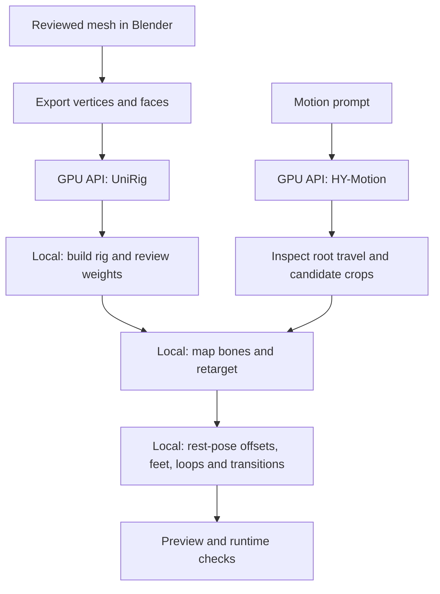

# Rigging and motion installation

Add these stages after [core setup](setup.md). UniRig predicts skeletons and skin
weights; HY-Motion generates raw body motion. Rig construction, semantic mapping,
retargeting and contact/loop cleanup belong on the consumer's Blender installation.
Neither generic model endpoint launches Blender on the GPU host.

## Sources and model files

From the repository root:

```sh
.venv/bin/python scripts/setup_sources.py UniRig HY-Motion-1.0
.venv/bin/python scripts/download_animation_models.py
```

Install and initialize Git LFS as described in core setup before cloning. HY-Motion
needs real `stats/Mean.npy` and `stats/Std.npy`, not LFS pointer text. For a checkout
created without LFS, run `git -C third_party/HY-Motion-1.0 lfs pull`.

The downloader currently installs **both** stages together, approximately 25.77 GB:

- UniRig skeleton and skin checkpoints, plus OPT-350m configuration (UniRig loads
  its own trained language-model weights; the OPT pretrained weights are unnecessary).
- HY-Motion-1.0 Lite checkpoint and configuration.
- Qwen3-8B text encoder and CLIP ViT-L/14 encoder, including tokenizers/configuration.

Repository revisions are pinned in the script. It validates file sizes and upstream
LFS hashes, writes per-repository manifests and `models/animation-downloads.json`,
and links the checkpoints into their upstream checkouts. It refuses conflicting
existing link destinations. Do not hand-copy just the motion checkpoint: the text
encoders are also required. Download completion does not establish environment or
inference readiness.

## UniRig environment

```sh
uv venv .venv-unirig --python 3.11
uv pip install --python .venv-unirig/bin/python \
  --extra-index-url https://download.pytorch.org/whl/cu126 --index-strategy unsafe-best-match \
  -r config/unirig-environment.txt
.venv-unirig/bin/python -c 'import torch, bpy, flash_attn, torch_scatter, torch_cluster, spconv; print("UniRig dependencies import")'
```

This environment uses Torch 2.7.1/CUDA 12.6. The snapshot includes explicit compatible
FlashAttention and PyG wheel URLs. It includes the `bpy` Python package required
by upstream imports; that is distinct from launching a Blender process. The
installed bpy wheel has produced a wheel-tag warning in package checks despite
successful imports and inference on this Python 3.11 installation. Check the actual
import and a smoke job when rebuilding.

Use the API's `unirig` operation with a numeric NPZ containing exactly `vertices`
and `faces`, in the coordinate convention described by the
[Blender handoff](blender-handoff.md#export-the-body-for-unirig). The worker prepares
input data and per-job inference configurations, runs skeleton/skin stages and
returns `rig-data.npz`. Mesh validation uses the core `.venv` as well.

The default direct-CLI configuration directory, `config/unirig/`, is generated
and ignored by Git. Direct CLI workflows must first run `scripts/configure_unirig.py`
with their asset/config paths; the API generates these configurations per job.

Character-specific scripts such as `prepare_unirig_peasant.py` are historical
reference helpers. They are not generic arbitrary-character CLI entry points.
Do not reuse a previous character's bone mapping or weight corrections blindly.

## HY-Motion environment

```sh
uv venv .venv-hymotion --python 3.11
uv pip install --python .venv-hymotion/bin/python \
  --extra-index-url https://download.pytorch.org/whl/cu126 --index-strategy unsafe-best-match \
  -r config/hymotion-environment.txt
.venv-hymotion/bin/python -c 'import torch, transformers; print("Motion dependencies import")'
```

The runner encodes the prompt in one process, then generates motion in another.
The Qwen encoder is large and uses CPU offload; budget system RAM as well as VRAM.
The tested machine has 64 GB RAM. Import checks alone do not establish that inference
fits on a different machine.

For a direct smoke run, keep prompt, seed and duration identical across both steps:

```sh
mkdir -p ~/.cache/shape-gen
flock ~/.cache/shape-gen/gpu.lock .venv-hymotion/bin/python scripts/run_hymotion.py encode \
  --output assets/motion-smoke --prompt 'A person walks forward at a relaxed pace.' --duration 4 --seed 12345
flock ~/.cache/shape-gen/gpu.lock .venv-hymotion/bin/python scripts/run_hymotion.py motion \
  --output assets/motion-smoke --prompt 'A person walks forward at a relaxed pace.' --duration 4 --seed 12345
```

For remote work use the `hymotion` operation with `inputs: {}` and prompt/seed
parameters. The endpoint supports four-second clips at 30 fps. It does not accept
starting bone poses, enforce a numeric walking speed, produce guaranteed foot
contacts or guarantee a seamless loop. See [motion diagnostics](motion-diagnostics.md)
for root travel, speed estimates and candidate repeating segments.

## Consumer handoff



Use the [Blender contract and recipes](blender-handoff.md) and
[versioned helper bundle](setup.md#blender-helper-downloads). The helper contract
currently targets a reviewed peasant humanoid mapping; a different skeleton needs
explicit adaptation. Validate deformation, material boundaries, rest pose and feet
before accepting clips. Successful array validation is not visual acceptance.
